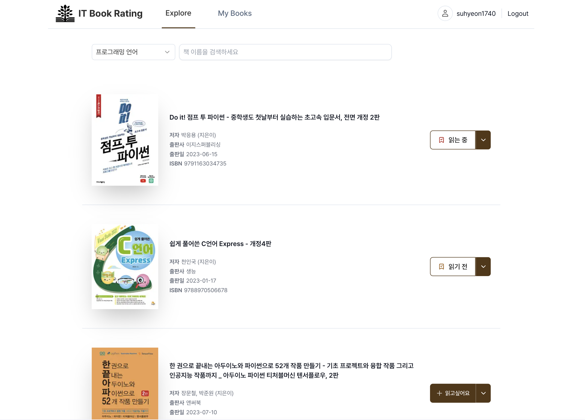
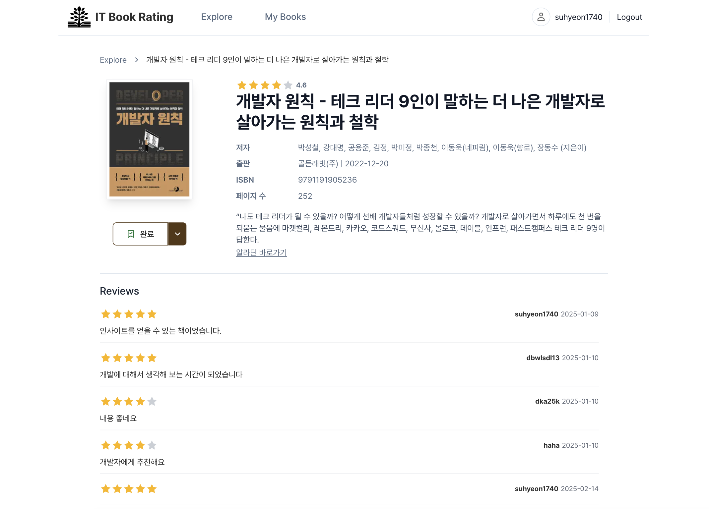
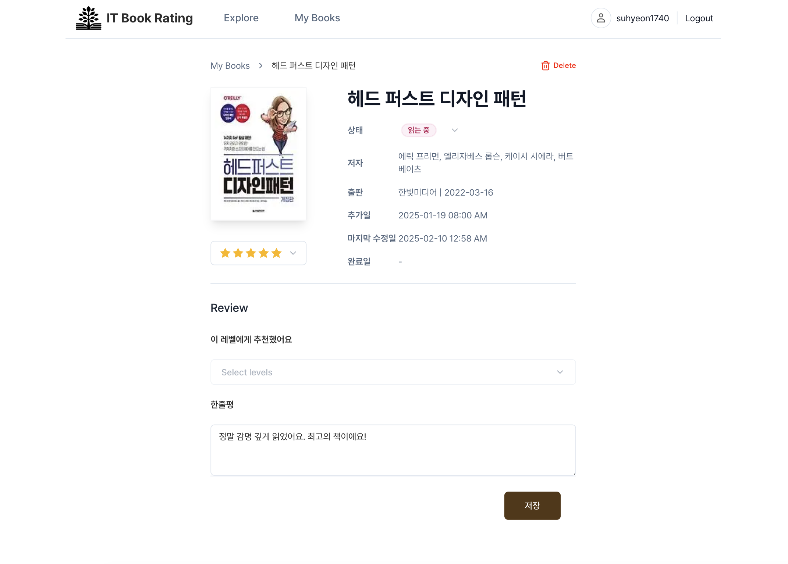
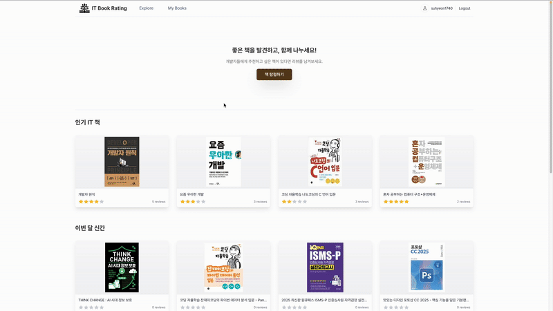

# IT Book Rating - Frontend

<div align="center">
    
</div>

**IT Book Rating**은 IT 책에 대한 리뷰와 평점을 공유하는 Next.js 기반 반응형 웹 애플리케이션입니다.

## 🛠️ 기술 스택

### Framework / Language


### Data Fetching / State Management


### Styling / UI


## 📺 화면 구성

|                              Home                              |                            Explore                             |
| :------------------------------------------------------------: | :------------------------------------------------------------: |
|            |         |
|                         Explore detail                         |                            My Books                            |
|  |  |

### GIF



## 🚀 주요 기능

- 책 검색
  - 알라딘 Open API를 활용한 IT 서적 검색 기능
  - 책 제목, 이미지 등 기본적인 책 이미지는 알라딘 API를 활용하고, 후기와 관련된 정보는 내부 시스템에서 추가로 조회
- 나의 책 리스트 관리
  - 책의 읽기 상태를 읽기 전 / 읽는 중 / 중단 / 완료로 관리
  - 검색 목록 또는 My books에서 책 상태 변경 가능
- 별점 및 한줄평 공유
  - 별점과 함께 리뷰 작성 가능

## 📦 프로젝트 아키텍처: FSD (Feature-Sliced Design)

### 📁 폴더 구조

```plaintext
src
 ┣ app                # 전역 스타일, 레이아웃, Provider 설정 등 애플리케이션 기본 구성
 ┃ ┣ font
 ┃ ┣ layouts
 ┃ ┣ providers
 ┃ ┣ styles
 ┣ entities           # 도메인별 API, 모델, 유틸 정리 (aladin, auth, book 등)
 ┃ ┣ aladin
 ┃ ┣ auth
 ┃ ┣ book
 ┃ ┣ my-book
 ┃ ┣ review
 ┣ features           # 사용자 인터랙션 중심의 기능 단위 구성
 ┃ ┣ auth
 ┃ ┣ explore
 ┃ ┃ ┗ book-filter
 ┃ ┣ my-books
 ┃ ┃ ┣ add-my-list
 ┃ ┃ ┣ remove-book
 ┃ ┃ ┣ update-status
 ┃ ┃ ┗ write-memo
 ┃ ┣ note
 ┃ ┃ ┗ write-note
 ┃ ┗ review
 ┃ ┃ ┣ add-review
 ┃ ┃ ┣ set-rating
 ┃ ┃ ┗ update-comment
 ┣ pages              # 라우트 단위의 페이지 구성
 ┃ ┣ explore
 ┃ ┣ explore-detail
 ┃ ┣ home
 ┃ ┣ login
 ┃ ┣ my-book-detail
 ┃ ┣ my-books
 ┃ ┗ register
 ┣ shared             # 전역적으로 사용되는 유틸, 훅, 타입 등 공통 모듈
 ┗ widgets            # 공통 레이아웃 UI (헤더, 푸터 등)
```

## 🔧 설치 및 실행 방법

```bash
# 저장소 클론
git clone https://github.com/username/book-rating-frontend.git
cd book-rating-frontend

# 패키지 설치
npm install

# 개발 서버 실행
npm run dev

# 빌드 및 배포
npm run build
npm start
```

## ✅ 테스트 실행

```bash
# 테스트 실행
npm run test

# 커버리지 리포트 포함 테스트 실행
npm run test:coverage
```

## 📈 프로젝트 개선 사항 (To-Do List)

- 노션과 같은 개인 메모 작성 기능 추가
- E2E 테스트 (Cypress 도입 고려)
